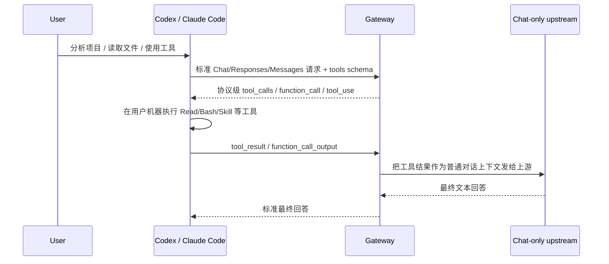

# Chat-only 上游补齐 Codex / Claude Code 工具能力方案

> 最后更新: 2026-06-26
> 当前验证上游: `http://47.85.40.209:8885`
> 当前模型: `mimo-v2.5-pro`

## 1. 目标

把一个只稳定支持普通对话的上游 API，包装成 Codex / Claude Code / OpenAI SDK / Anthropic SDK 可直接使用的工具型 Gateway。

这里的“支持 tools/function calls”不是让上游模型自己原生返回工具调用；当前上游实测不会这么做。目标是：

- 下游客户端仍收到标准协议字段。
- Codex / Claude Code 能按原生 tools 模型的流程执行本地工具。
- 上游只负责普通对话和最终文本生成。
- 用户机器文件、shell、skills 等工具默认由下游客户端执行，不由 Gateway 服务机擅自执行。

## 2. 当前上游实测结论

实测请求覆盖：

- `GET /v1/models`
- `POST /v1/chat/completions`
- `POST /v1/chat/completions` with `stream=true`
- `POST /v1/responses`
- `POST /v1/responses` with `stream=true`
- `POST /v1/messages`
- `POST /v1/messages` with `stream=true`
- `POST /v1/chat/completions` with `tools=[test_tool]`

结论：

| 能力 | 结果 | 配置 |
|---|---|---|
| Models | 可用 | `/v1/models` |
| Chat Completions | 可用 | `protocol=openai_chat` |
| Responses | 可用，但 Gateway 统一转上游 Chat 路径也可工作 | `paths.responses=/v1/responses` |
| Anthropic Messages | 可用 | `paths.messages=/v1/messages` |
| Stream | 可用 | `supports_streaming=true` |
| Native Chat `tool_calls` | 不可用；上游接受 `tools` 但返回 `tool_calls:null` | `supports_tools=false` |
| Native Responses `function_call` | 不作为可信能力使用 | `supports_function_calls=false` |
| Native Anthropic `tool_use` | 不作为可信能力使用 | `supports_tools=false` |

因此该上游必须按 **chat-only / weak-tools upstream** 接入。

## 3. 最终配置

### 3.1 本地运行配置

运行时使用 `.gateway_service.json`，该文件被 `.gitignore` 忽略，用来保存真实上游密钥。密钥字段通过项目的 Fernet 配置加密，不进入 git。

关键配置：

```json
{
  "upstream": {
    "base_url": "http://47.85.40.209:8885",
    "model": "mimo-v2.5-pro",
    "protocol": "openai_chat",
    "tools_enabled": "adapter",
    "native_tools_verified": false,
    "capabilities": {
      "supports_streaming": true,
      "supports_tools": false,
      "supports_function_calls": false,
      "supports_parallel_tool_calls": false,
      "supports_vision": false,
      "supports_network": false,
      "supports_web_search": false,
      "supports_json_schema": false
    }
  },
  "gateway": {
    "tool_mode": "orchestrate",
    "execute_user_side_tools_in_gateway": false,
    "local_planner_enabled": true,
    "text_tool_call_fallback_enabled": true,
    "max_tool_rounds": 10
  }
}
```

### 3.2 可提交模板配置

`gateway.config.json` 只保留无密钥模板：

- 可以提交上游地址和能力矩阵。
- 不提交 `sk-*`、`Authorization`、`Bearer` 等真实凭据。
- 本地实际密钥只放 `.gateway_service.json` 或环境变量。

## 4. 核心适配策略

### 4.1 下游协议保持真实工具字段

当下游需要工具时，Gateway 直接返回协议级工具调用，不把它伪装成普通文本。

OpenAI Chat Completions：

```json
{
  "choices": [
    {
      "message": {
        "role": "assistant",
        "content": null,
        "tool_calls": [
          {
            "type": "function",
            "function": {
              "name": "get_weather",
              "arguments": "{\"location\":\"San Francisco today\"}"
            }
          }
        ]
      },
      "finish_reason": "tool_calls"
    }
  ]
}
```

OpenAI Responses：

```json
{
  "output": [
    {
      "type": "function_call",
      "call_id": "client_required_...",
      "name": "exec_command",
      "arguments": "{\"cmd\":\"pwd; find . -maxdepth 3 ...\"}"
    }
  ]
}
```

Anthropic Messages：

```json
{
  "type": "message",
  "role": "assistant",
  "content": [
    {
      "type": "tool_use",
      "id": "client_required_...",
      "name": "Read",
      "input": {"file_path": "/absolute/path/to/file"}
    }
  ],
  "stop_reason": "tool_use"
}
```

### 4.2 用户侧工具默认下发给客户端

这些工具默认不在 Gateway 服务机执行，而是返回给 Codex / Claude Code：

- `Read`
- `LS`
- `Glob`
- `Grep`
- `Write`
- `Edit`
- `Bash` / `exec_command`
- `Skill`
- 本地 GUI / computer-use / local agent 类工具

原因：

- Codex / Claude Code 自带权限、沙箱、审批和本地项目上下文。
- Gateway 服务 cwd 不应被误当作用户项目 cwd。
- 读写文件和 shell 是用户机器边界，不应由中游服务默认代执行。

### 4.3 Gateway-owned 工具仍可由 Gateway 执行

这些工具属于服务端能力，可以由 Gateway 自己执行：

- HTTP Actions
- MCP server tools/resources
- `WebFetch`
- `WebSearch`
- `calculator`
- `get_current_time`
- Memory / persistence 类工具
- 纯函数或服务端状态类工具

### 4.4 schema 适配

真实客户端声明的工具 schema 不完全一致，Gateway 会按下游 schema 改参数名：

| 场景 | 客户端声明 | Gateway 输出 |
|---|---|---|
| Claude Code Skill | `Skill(skill, args)` | `{"skill":"live-skill"}` |
| Claude Code Read | `Read(file_path)` | `{"file_path":"/absolute/path"}` |
| Claude Code Bash | `Bash(command)` | `{"command":"..."}` |
| Codex shell | `exec_command(cmd)` | `{"cmd":"..."}` |
| OpenAI custom function | `get_weather(location)` | `{"location":"San Francisco today"}` |

如果下游没有 `LS/Glob`，但有 `exec_command`，项目分析会退到 shell：

```bash
pwd
find . -maxdepth 3 -type f \( -name '*.py' -o -name '*.md' -o -name '*.json' -o -name '*.toml' -o -name '*.yaml' -o -name '*.yml' \) | sort | head -200
```

## 5. 请求生命周期



## 6. 启动方式

```bash
cd /Users/sanbo/Desktop/ai_tool_functioncall

NO_PROXY=127.0.0.1,localhost no_proxy=127.0.0.1,localhost \
python3 src/toolcall_gateway.py --host 127.0.0.1 --port 8885
```

健康检查：

```bash
curl http://127.0.0.1:8885/healthz

curl http://127.0.0.1:8885/v1/models \
  -H "Authorization: Bearer <DOWNSTREAM_API_KEY>"
```

Claude Code：

```bash
ANTHROPIC_BASE_URL="http://127.0.0.1:8885/anthropic" \
ANTHROPIC_AUTH_TOKEN="<DOWNSTREAM_API_KEY>" \
ANTHROPIC_API_KEY="" \
claude
```

Codex config 示例：

```toml
model_provider = "gateway"
model = "mimo-v2.5-pro"
model_reasoning_effort = "none"
model_context_window = 1048576
model_max_output_tokens = 131072

[model_providers.gateway]
name = "gateway"
base_url = "http://127.0.0.1:8885/v1"
env_key = "OPENAI_API_KEY"
wire_api = "responses"
```

启动 Codex：

```bash
OPENAI_API_KEY="<DOWNSTREAM_API_KEY>" codex
```

## 7. 验证命令

### 7.1 单元/集成测试

```bash
python3 -m py_compile \
  src/toolcall_gateway.py \
  src/gateway_app.py \
  src/gateway_tool_runtime.py \
  src/gateway_streaming.py \
  src/gateway_protocol.py \
  src/gateway_http_handler.py \
  tests/integration/project_scope_cli_smoke.py

python3 -m pytest -q
```

当前结果：

```text
896 passed, 2 skipped, 21 warnings
```

### 7.2 本地 chat-only mock + 真实 CLI 烟测

```bash
NO_PROXY=127.0.0.1,localhost no_proxy=127.0.0.1,localhost \
python3 tests/integration/project_scope_cli_smoke.py --require-claude --require-codex
```

当前结果：

```json
{
  "pass": true,
  "claude": {"rc": 0, "ok": true},
  "codex": {"rc": 0, "ok": true}
}
```

### 7.3 真实上游适配烟测

已对 `http://47.85.40.209:8885` 做临时端口烟测，结果：

```json
{
  "models_ok": true,
  "chat_ok": true,
  "messages_tool_use_ok": true,
  "responses_exec_tool_ok": true,
  "custom_tool_ok": true,
  "stream_ok": true,
  "claude_cli_ok": true,
  "codex_cli_ok": true
}
```

证据目录：

```text
.gateway_runtime/real-upstream-adapter-smoke-20260625-234218
```

## 8. 安全边界

- 不把真实上游密钥写入 git 跟踪文件。
- `gateway.config.json` 只做无密钥模板。
- `.gateway_service.json` 被 `.gitignore` 忽略，保存本地加密密钥字段。
- 用户侧文件/shell/skills 默认由 Codex / Claude Code 在用户机器执行。
- Gateway 不缓存 tool request 回合，避免旧工具调用跨请求复用。
- `NO_PROXY=127.0.0.1,localhost` 用于避免 macOS/urllib 代理污染本地网关请求。

## 9. 相关文件

- `src/gateway_tool_runtime.py`：工具意图识别、协议级工具调用合成、schema 适配。
- `src/gateway_http_handler.py`：请求入口和 tool request 缓存保护。
- `src/gateway_streaming.py`：streaming adapter 与隐式工具注入保护。
- `src/gateway_protocol.py`：Chat / Responses / Messages 协议互转。
- `tests/test_gateway.py`：弱上游工具回合、schema 适配、自定义 function 回归测试。
- `tests/integration/project_scope_cli_smoke.py`：chat-only 上游 + 真实 Codex/Claude Code CLI 烟测。
- `gateway.config.json`：无密钥可提交模板。
- `.gateway_service.json`：本地运行配置，gitignored。

## 10. Agent Planner 多轮 smoke（2026-06-26）

为验证 chat-only upstream 不具备原生 tool planning 时，外层 gateway 是否能补齐规划能力，新增本地自包含 smoke：

```bash
python3 tests/integration/agent_planner_multiround_smoke.py
```

通过标准：

- downstream client 执行真实 `Bash` / `Read` / `Edit`；
- fake chat-only upstream 不执行工具，只返回 JSON patch 和最终文本；
- gateway planner 完成：测试失败 -> 诊断读取 -> import 源码跟进读取 -> patch JSON 适配 -> Edit -> rerun tests -> final synthesis；
- 上游调用次数保持为 2：一次 patch synthesis，一次 final synthesis。

当前结果：

```json
{
  "ok": true,
  "steps": ["Bash", "Read", "Read", "Read", "Read", "Edit", "Bash"],
  "upstream_calls": 2,
  "final_text": "修复完成，pytest 已通过。"
}
```

结论：对于 `mimo-v2.5-pro` 这类 native tools 不可靠/不支持的上游，应使用 adapter + Agent Planner 模式；上游只承担语言合成，不承担工具规划。

## 11. 远端服务稳定性补充：所有 runtime 路径必须按 client scope 可观测

当前方案的核心边界不变：chat-only upstream 只负责最终 synthesis；Agent Planner / Gateway Runtime 负责外层调度；用户机器工具默认下发给 client，在 client 自己的 workspace 执行。

本轮补充的远端稳定性要求：

1. Gateway 不使用服务机 cwd 推断用户 workspace。
2. tenant/session/workspace 是所有 runtime state 的 namespace。
3. Gateway-owned service tools 可以在服务端执行，但必须记录：
   - `gateway_tool_execute`
   - `gateway_tool_result`
4. 非 planner fallback 的 downstream tool request 也必须记录：
   - `tool_dispatch`，workflow=`direct_downstream_tool_request`
5. Admin runtime timeline 必须能区分：
   - planner-managed tool dispatch/result
   - service-side Gateway-owned execute/result
   - fallback downstream dispatch
   - memory rollup / planner state

新增验证命令：

```bash
python3 -m pytest tests/test_gateway.py::NativeGatewayTests::test_gateway_owned_preexecute_records_runtime_events_by_remote_scope \
  tests/test_gateway.py::WeakUpstreamToolRoundSurfacingTests::test_direct_downstream_fallback_records_remote_runtime_event -q
# 2 passed
```

设计结论：外层补全不是让模型“原生支持 tool calls”，而是让远端 Agent Planner 作为可靠调度层，把 chat-only 模型限制在最终表达；所有真实工具执行要么由 Gateway-owned service tool 明确服务端执行，要么由 client 在自己的 workspace 执行。

### 11.1 Full verification snapshot

```bash
python3 -m pytest -q
# 947 passed, 2 skipped, 21 warnings in 47.82s

python3 tests/integration/agent_planner_project_analysis_smoke.py
# ok=true; upstream_calls=1

python3 tests/integration/agent_planner_multiround_smoke.py
# ok=true; upstream_calls=2

python3 tests/integration/project_scope_cli_smoke.py --require-claude --require-codex
# pass=true; claude.ok=true; codex.ok=true; memory_service_root_leak=false; direct_list_leaks_service_skills=false
```

## 12. Ignored upstream tool attempts observability（2026-06-26）

在最终 synthesis 阶段，chat-only upstream 没有工具权限：请求体不包含 `tools/tool_choice`，响应也不会再进入 tool extraction / intent fallback。为了远端服务稳定运维，本轮增加只读可观测事件：

```json
{
  "event_type": "upstream_tool_attempt_ignored",
  "workflow": "chat_only_synthesis",
  "step": "ignore_upstream_tool_attempt",
  "metadata": {
    "source": "non_streaming | streaming",
    "tool_authority_granted": false,
    "calls": [{"name": "Edit"}],
    "response_chars": 123
  }
}
```

设计边界：

- 该事件不代表工具 dispatch；只是记录弱上游输出了工具形态文本。
- 不会调用 `_execute_tool_call()`。
- 不会向 downstream client 生成 `tool_use`。
- event scope 使用 client 原始 tenant/session/workspace，适合多用户远端排查。
- payload 有上限，避免弱上游输出超大 JSON 导致 runtime SQLite 膨胀。

验证：

```bash
python3 -m pytest tests/test_gateway.py::WeakUpstreamToolRoundSurfacingTests::test_chat_only_final_synthesis_ignores_upstream_json_tool_request \
  tests/test_gateway.py::AnthropicSSEFormatTests::test_streaming_agent_planner_synthesizes_after_symbol_deep_dive -q
# 2 passed
```

## 13. Boundary activation rule: adapter mode is not automatically final synthesis

Important correction from full regression: `tools_enabled=adapter` / weak upstream mode is not enough to enable the hard `chat_only_synthesis` boundary. Some requests still intentionally exercise a normal tool loop, especially native-capable compatibility tests or text-tool fallback tests.

The hard boundary is now enabled only when the request is already owned by the outer Agent Planner final turn:

- `gateway_context.strategy == "agent_planner_final_synthesis"`, or
- `gateway_context.agent_planner` exists because Gateway-owned service-tool evidence has already been produced.

Result:

- normal orchestration can still parse/execute legitimate tool calls;
- Agent Planner final synthesis strips tools and ignores upstream pseudo-tool attempts;
- remote service behavior is less brittle under concurrent mixed workloads.

Full verification:

```bash
python3 -m pytest -q
# 953 passed, 2 skipped, 21 warnings
```

## 14. Agent Planner capability registry

远端 Agent Planner 现在提供能力注册表：

```http
GET /admin/agent-capabilities.json
Authorization: Basic ...
```

核心字段：

```json
{
  "mode": "remote_agent_planner",
  "chat_only_upstream_role": "synthesis_only",
  "ownership_model": {
    "gateway_service": "service-owned pure/network/connectors may run before upstream synthesis",
    "downstream_client": "filesystem, shell, GUI, local agent, and caller-private tools run in the client workspace",
    "chat_only_upstream": "language synthesis only; no tool authority"
  },
  "workflows": [],
  "service_side": [],
  "downstream_owned": [],
  "http_actions": [],
  "mcp_servers": []
}
```

这个 endpoint 的目的不是执行工具，而是让运维/客户端能直接看到 planner 调度边界：

- Gateway-owned service tools：calculator、current_time、WebSearch、HTTP Actions、MCP connectors。
- Downstream-owned user-machine tools：Read、Write、Edit、Bash、Skill、GUI/local agent 等。
- Chat-only upstream：只做最终语言表达。

`/admin/agent-runtime.json` 同时内嵌 `runtime.capabilities`，可把当前 state/memory/events 和能力注册表一起观察。

## 15. Workflow registry is the source of truth

Agent Planner workflows now come from `WORKFLOW_REGISTRY` in `src/gateway_agent_planner.py`.

The registry drives both:

- planner progress tool calls (`update_plan` / `TodoWrite` plan items);
- `/admin/agent-capabilities.json` and `/admin/agent-runtime.json` workflow catalog.

This avoids drift between actual planner behavior and Admin/runtime observability.
